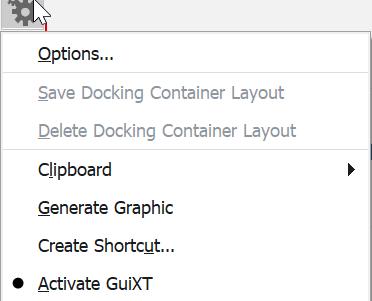
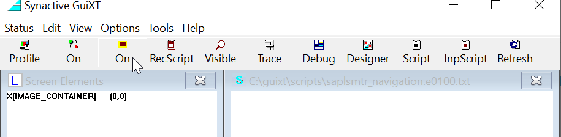
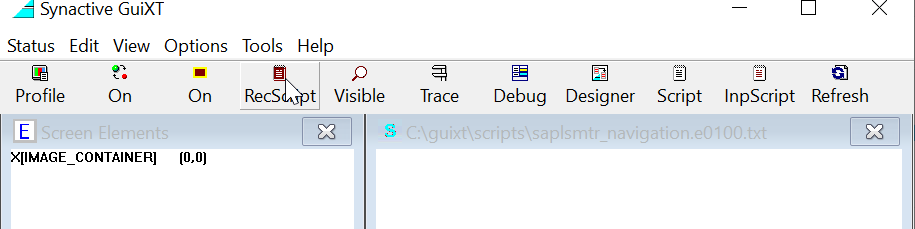

# pythonizesap
Automatic data extraction from SAP using Python

# Motive
Well, I am a lazy data engineer who needs to crunch the data from the SAP ERP system every day, so I decided to develop a tool to automate the data extraction process. If you are like me, please go ahead and try it.

# Features:

* Auto login and terminate other working sessions of SAP GUI
* Refresh system tray
* Run extraction task based on schedule

# GuiXT
Wikipedia: GuiXT is a software component that allows the customization of the SAP user interface. It was developed as a standalone solution in 1998 by Synactive GmbH, Germany, and shortly after that, integrated into SAP GUI by SAP.

You can think of it as a macro tool in SAP, in which you can record your steps and execute that script by other languages. In this case, I use Python.

* Activate GuiXT



* Enable recording



* View the script



I use the LX02 transaction as the example for this module, and you will see the GuiXT script as below.
For any filter, please name it as "inVariable" so that in the Python program, we can change it to whatever we want.

```
// SAP Easy Access 
Screen SAPLSMTR_NAVIGATION.0100
Enter "LX02"

// WM Stock: Initial Screen 
Screen RLS10020.1000
Set F[%_S1_LGNUM_%_APP_%-TEXT]  "inWarehouse"
Set F[Plant]    "inPlant"
Set F[Layout]   "/BLOCKLX02"
Enter "/8"          // Execute

// WM Stock with Material Description 
Screen RLS10020.0120
Enter "/9"          // Local File...

// Save list in file... 
Screen SAPLSPO5.0110
Enter

// WM Stock with Material Description 
Screen SAPLSFES.0200
Set F[File Name]    "LX02_inTimetamp.csv"
Enter "/11"         // Replace

// WM Stock with Material Description 
Screen RLS10020.0120
Enter "/15"         // Exit

// WM Stock: Initial Screen 
Screen RLS10020.1000
Enter "/15"         // Exit
```